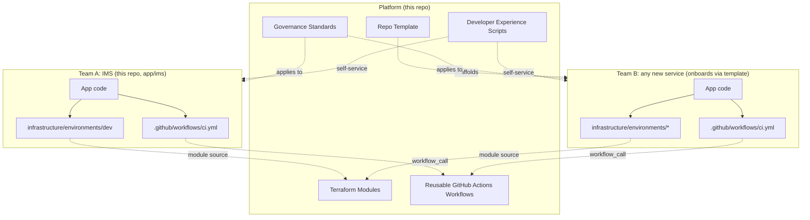

# AI Engineering Specification: Platform

## 1. Purpose
Define the overall Internal Developer Platform (IDP) that Acme Retail's application teams build on top of,
so that every team gets consistent CI/CD, infrastructure, security, and documentation practices without
re-inventing them per application. This spec is the contract an AI coding agent (or a human engineer) follows
when generating or extending any platform component.

## 2. Problem Statement
Today, each application team hand-rolls its own pipelines, Terraform, repo layout, and specs. This produces:
duplicate pipelines, duplicate Terraform, inconsistent repo structures, inconsistent AI specifications, long
onboarding, and high maintenance cost. The platform exists to eliminate this duplication.

## 3. Scope
In scope:
- A shared library of Terraform modules (see `terraform-modules-spec.md`).
- A shared library of reusable GitHub Actions workflows (see `workflow-spec.md`).
- A repo template new teams copy to onboard (see `repo-template-spec.md`).
- Governance, security, and compliance standards applied uniformly (see `governance-spec.md`).
- Developer-experience tooling: bootstrap scripts, service scaffolding, self-service docs (see
  `developer-experience-spec.md`).
- One reference application (the Inventory Management System, `app/ims`) that consumes every platform
  capability end-to-end, proving the platform works and stays reusable.

Out of scope:
- A dedicated internal developer portal UI (e.g. Backstage). The platform is delivered as git-native reusable
  assets (modules, workflows, templates) rather than a hosted service, since no shared cloud/hosting account
  exists for this capstone.
- Multi-cloud abstraction. AWS is the target cloud; the module interfaces are provider-agnostic in *shape*
  (inputs/outputs) but the implementation is AWS-specific.

## 4. Architecture Overview

Both teams call the *same* reusable workflows and source the *same* Terraform modules; only inputs/variables
differ. This is the mechanism that eliminates duplicate pipelines and duplicate Terraform.

## 5. Requirements
- R1: Every reusable capability MUST live in exactly one place (module, workflow, script) and be consumed by
  reference, never copy-pasted per application.
- R2: Every application onboarding the platform MUST be able to get CI/CD, security scanning, and
  infrastructure with changes limited to variables/inputs (app name, port, resource sizing) — no workflow or
  module logic edits required for the common case.
- R3: All infrastructure MUST be defined as Terraform, versioned, and validated in CI before merge.
- R4: All application images MUST be scanned for vulnerabilities and all Terraform MUST be scanned for
  misconfiguration before merge (see `governance-spec.md`).
- R5: The entire platform MUST be runnable and demonstrable on a local developer machine (Docker Desktop /
  Podman + local Postgres, `terraform validate`/`plan`) without a live cloud account, per the capstone's
  "no dedicated cloud resources required" rule.
- R6: Every architectural decision with real trade-offs MUST be recorded as an ADR in
  `docs/engineering-decisions/`.

## 6. Non-Functional Requirements
- Reproducibility: `git clone` + documented setup commands must produce a working local demo on any
  Windows/macOS/Linux machine with Node.js, Docker/Podman, and Terraform installed.
- Least privilege: IAM roles generated by `iam-app-role` grant only the actions a service needs.
- Observability: every service exposes a `/health` endpoint; CI/CD failures are visible in workflow run logs.

## 7. Acceptance Criteria
- [ ] A second (hypothetical) application team can describe, in under 30 minutes of reading
      `repo-template-spec.md` + `developer-experience-spec.md`, everything needed to onboard.
- [ ] `app/ims` builds, tests, and runs locally using only the shared workflows/modules — no bespoke logic
      duplicated outside the platform layer.
- [ ] All 6 required AI Engineering Specifications exist, are internally consistent, and are cross-linked.

## 8. Related Specifications
`terraform-modules-spec.md` · `workflow-spec.md` · `repo-template-spec.md` · `governance-spec.md` ·
`developer-experience-spec.md`
