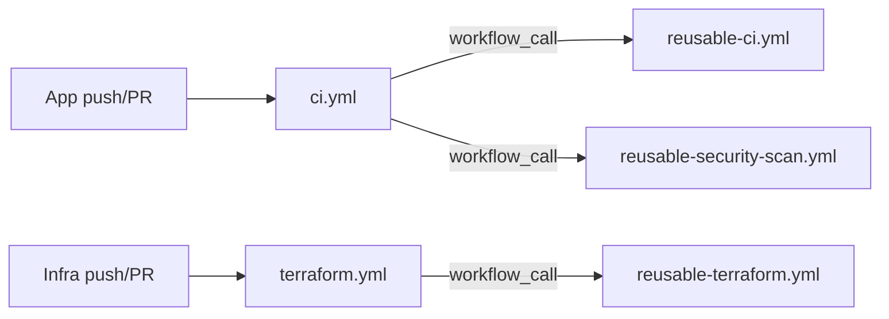

# AI Engineering Specification: CI/CD Workflows

## 1. Purpose
Define a shared library of reusable GitHub Actions workflows so that every application's CI/CD pipeline is a
thin caller, not a hand-maintained copy — solving the "duplicate pipelines" problem directly.

## 2. Design Pattern
All shared logic lives in workflows using `on: workflow_call` under `.github/workflows/reusable-*.yml`.
Application-level workflows (`ci.yml`, `terraform.yml`) contain no build/test/scan logic themselves — they
only declare triggers and call the reusable workflows with `with:` inputs. A workflow's *inputs* are the only
thing an application team should ever need to change.

## 3. Workflow Catalog

### `reusable-ci.yml` (workflow_call)
Inputs: `app_dir` (path to app), `node_version` (default `20`), `image_name`.
Steps: checkout → setup-node with npm cache → `npm ci` → `npm run lint` → `npm test` → `docker build`
(buildx, no push) tagged `image_name:ci-<sha>` → upload test results as an artifact.

### `reusable-security-scan.yml` (workflow_call)
Inputs: `app_dir`, `image_name`, `terraform_dir` (optional).
Steps:
- Gitleaks over the full checkout (secret scanning) — fails the job on any finding.
- Trivy filesystem scan over `app_dir` (dependency vulnerabilities) — fails on CRITICAL/HIGH.
- Trivy image scan over the image built by `reusable-ci.yml` — fails on CRITICAL/HIGH.
- Checkov over `terraform_dir` when provided — fails on HIGH/CRITICAL misconfigurations.
- All results uploaded as SARIF artifacts for review.

### `reusable-terraform.yml` (workflow_call)
Inputs: `working_dir`.
Steps: checkout → setup-terraform → `terraform fmt -check -recursive` → `terraform init -backend=false` →
`terraform validate` → Checkov static analysis. No `plan`/`apply` in CI for this capstone (no shared cloud
credentials) — documented as the consuming team's next step once real cloud credentials exist.

### `ci.yml` (caller, triggers: push/PR touching `app/ims/**`)
Calls `reusable-ci.yml` with `app_dir: app/ims`, then `reusable-security-scan.yml` with the same inputs.

### `terraform.yml` (caller, triggers: push/PR touching `infrastructure/**`)
Calls `reusable-terraform.yml` once per changed environment/module directory (matrix over
`infrastructure/environments/*` and `infrastructure/modules/*`).

## 4. Requirements
- R1: No workflow may inline build/test/scan/terraform logic outside the `reusable-*.yml` files — caller
  workflows are inputs-only.
- R2: Every workflow MUST pin third-party actions to a full commit SHA or an explicit version tag (never
  `@main`/`@master`).
- R3: Security scan jobs MUST run on every pull request, not just on merge to main — shift-left, not
  after-the-fact.
- R4: Secrets (registry credentials, cloud credentials) are referenced only via `${{ secrets.* }}`, never
  inlined; none exist yet in this capstone since no image registry/cloud account is provisioned — documented
  as a TODO placeholder input (`registry_url`) rather than a hardcoded value.
- R5: Every job MUST set an explicit `permissions:` block (least privilege, default `contents: read`).
- R6: Workflow YAML MUST be valid (parseable) — enforced by `scripts/validate-terraform.ps1`'s sibling check
  described in `developer-experience-spec.md`, and by this repo's own commit history (each workflow file is
  parsed with a YAML linter before commit).

## 5. Dockerfile Requirements (enforced indirectly via `reusable-ci.yml` building the image)
- Multi-stage build; final stage runs as a non-root user.
- Base image pinned to a specific digest/tag family (no `:latest`).
- `HEALTHCHECK` instruction present.

## 6. Acceptance Criteria
- [ ] `app/ims`'s `ci.yml` contains zero build/test/scan steps of its own — only `uses:` + `with:`.
- [ ] A second application onboarding via the repo template only needs to set `app_dir`/`image_name` inputs
      in its copy of `ci.yml` to get full CI + security scanning.
- [ ] All workflow YAML files parse successfully (`python -c "import yaml; yaml.safe_load(...)"` over every
      file in `.github/workflows/` and `templates/service-repo-template/.github/workflows/`).

## 7. Related Specifications
`platform-spec.md` · `terraform-modules-spec.md` · `governance-spec.md` · `repo-template-spec.md`
