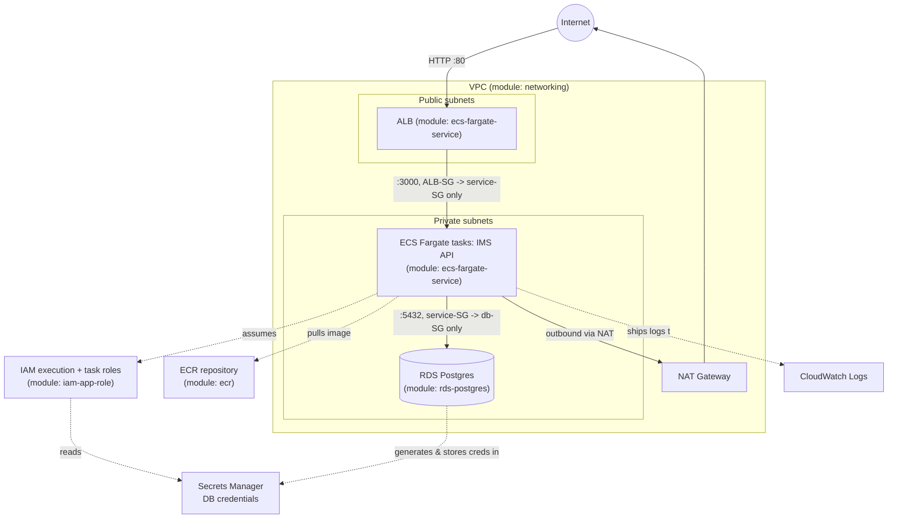
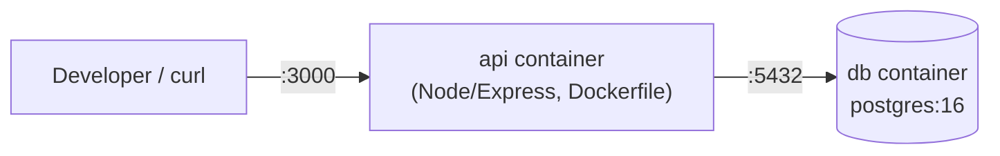
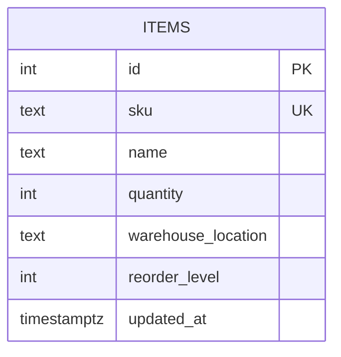

# IMS Architecture

## AWS target architecture (`infrastructure/environments/dev`)

## Local demo architecture (`app/ims/docker-compose.yml`)

The local demo intentionally mirrors the AWS shape at the application layer (same image, same environment
variable contract — `PGHOST`/`PGPORT`/`PGUSER`/`PGPASSWORD`/`PGDATABASE`) so behavior validated locally
transfers directly to the ECS deployment; only the *infrastructure* wrapping around the container differs.

## Data model

