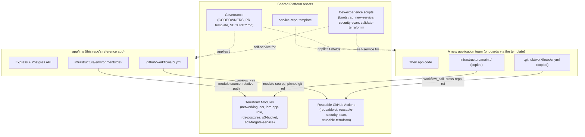
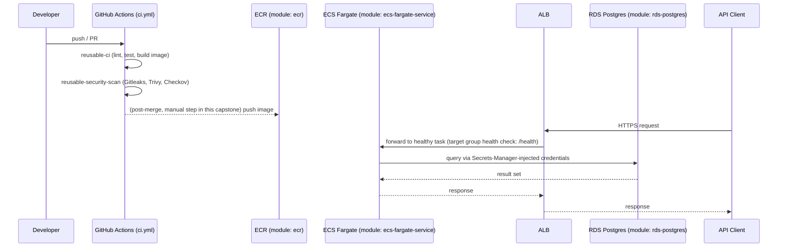

# Platform Architecture

## Overview

The group1-advanced platform is a set of git-native reusable assets — not a hosted service — because no
shared cloud account or internal-developer-portal hosting exists for this capstone. Every application team
consumes the same modules, workflows, and template; only inputs differ.

## Why this shape (not a hosted IDP portal)

A Backstage-style portal was considered and rejected for this capstone — see
`docs/engineering-decisions/ADR-0001-cloud-and-compute-choice.md` and
`ADR-0003-repo-template-and-onboarding.md` for the reasoning. In short: it would require a shared hosting
environment this capstone explicitly cannot assume exists, and it would not change the underlying mechanism
(reusable modules/workflows) that actually solves the stated business problems.

## Request flow for the reference application (IMS)

See `docs/architecture/ims-architecture.md` for the IMS-specific resource diagram.
